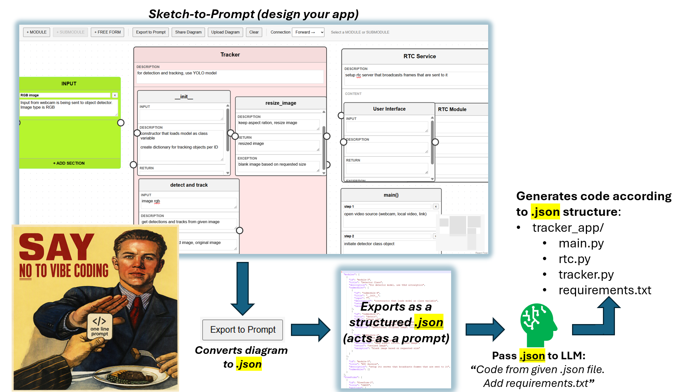

# Sketch2Prompt

**Sketch your app. Export it as prompt.**



Sketch2Prompt is a visual application-design tool that converts diagrams into structured JSON prompts. Users can map an application's modules, submodules, content, and connections before sending the exported prompt to an AI coding system to generate the application.

## How It Works

1. Design the application as a visual diagram.
2. Describe its modules, submodules, inputs, outputs, and behavior.
3. Connect components and define their relationships.
4. Export the diagram as structured JSON.
5. Use the generated JSON as a prompt for building the application.

## Current Features

- Create, edit, resize, and reposition module boxes
- Add nested submodules to modules
- Create customizable free-form boxes and sections
- Connect boxes with directional arrows or plain lines
- Customize connection colors and line styles
- Customize box colors, borders, and border styles
- Save and reload complete diagrams as JSON
- Export streamlined, prompt-ready JSON

## Built With

- React
- TypeScript
- React Flow
- Zustand
- Vite

## Run Locally

```bash
npm install
npm run dev
```

Open the local address displayed by Vite in your browser.

## Project Status

Sketch2Prompt is in its initial working stage. The core diagram editor and JSON export workflow are functional, with more documentation and improvements planned.

## License

A license will be added later.
